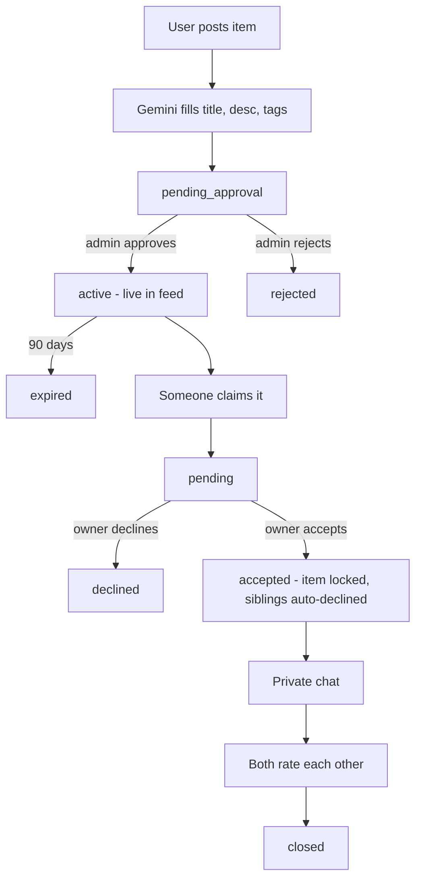

<div align="center">

# 🔍 FoundMe

### The campus lost-and-found that actually finds things.

A Flutter + Firebase app for **USIM** students. Post what you lost or found, let Gemini describe the photo and hunt for matches, then settle the handover through an in-app claim and chat — with every post moderated before it goes live.

<br>

[](https://flutter.dev)
[](https://firebase.google.com)
[](https://ai.google.dev)
[](https://www.typescriptlang.org)

<sub>Android · iOS · 10 Cloud Functions · Rules-enforced state machines</sub>

</div>

---

## ✨ What it does

<table>
<tr>
<td width="50%" valign="top">

### 📸 Post in seconds
Snap up to 4 photos and `analyzeItemImage` runs **Gemini** over the first one to pre-fill the title, description, category, and tags. Pin the spot on a map, submit. The post lands in `pending_approval` — invisible until an admin approves it.

</td>
<td width="50%" valign="top">

### 🧠 AI matching
The moment you post, `findMatchingItems` pulls up to 20 active items of the **opposite** type (you lost → it scans found) in the same category, and asks Gemini which ones genuinely match. Anything scoring **above 60** comes back with a reason.

</td>
</tr>
<tr>
<td width="50%" valign="top">

### 🤝 Claim & chat
Send a claim with a message; the owner gets a push. Accepting **locks the item** (`acceptedClaimId`) so a second claim can never also be accepted, and auto-declines the rest. Both parties get a private chat scoped to that claim.

</td>
<td width="50%" valign="top">

### ⭐ Mutual ratings
Once a claim is accepted or closed, each side rates the other — **once**. Ratings are written server-side inside a transaction; the client can't touch `averageRating` or `ratingCount` at all.

</td>
</tr>
<tr>
<td width="50%" valign="top">

### 🎓 Matric verification
Upload your matric card and `verifyMatricCard` asks Gemini whether it's a genuine **USIM** student ID, extracts the matric number, and rejects one already registered to someone else. The card and number live in an admin-only collection — admins fetch a **15-minute signed URL** on demand, never a permanent link.

</td>
<td width="50%" valign="top">

### 🛡️ Admin console
Five tabs: **Overview** (charts), **Approvals** (approve/reject posts, review matric cards), **All Items**, **Users** (ban/unban via Firebase Auth), and **Reports**. Guests can browse — and nothing else. Items auto-expire after 90 days.

</td>
</tr>
</table>

<!-- SCREENSHOTS — hidden until the PNGs land in docs/screenshots/.
     Add feed.png, item-detail.png, add-item.png, map.png, chat.png, admin.png
     to docs/screenshots/, then delete this comment's opening and closing lines
     to reveal the section.

## 📱 Screenshots

<div align="center">

| Feed | Item detail | Add item (AI fill) |
|:---:|:---:|:---:|
|  |  |  |

| Map view | Claims & chat | Admin console |
|:---:|:---:|:---:|
|  |  |  |

</div>

-->

## 🔄 How an item moves through the app



## 🏗️ Architecture

<details>
<summary><b>Project layout</b></summary>

```
lib/
  main.dart              AuthGate — the single routing source of truth:
                         signed out → login · guest → home · unverified email → verify
                         · admin → admin console · unverified matric → matric page · else home
  models/                ItemModel, ClaimModel, UserModel, ChatMessage
  models/status.dart     Canonical ClaimStatus / ItemStatus vocabularies + legacy normalizers
  services/              Singleton service layer over Firebase:
                         auth · item · claim · review · report · notification · ai_matching · log
  pages/                 Feed, Map, Add/Edit item, Item detail, Claims inbox, My claims,
                         Chat, Profile, Matric verification, Auth screens, Admin shell
  admin/                 The 5 admin dashboard tabs
  widgets/               Feed card, map picker, rating + report dialogs
functions/src/index.ts   All Cloud Functions
firestore.rules          Firestore security rules
storage.rules            Storage security rules
```

</details>

<details>
<summary><b>Data model</b></summary>

**Collections:** `users` · `items` · `claims` · `messages` (flat, keyed by `claimId`) · `reports` · `logs` · `verifications` (admin-read only)

| Lifecycle | States |
|---|---|
| **Item** | `pending_approval → active → closed \| expired`, or `rejected` |
| **Claim** | `pending → accepted \| declined → closed` |

Both are enforced as **state machines inside `firestore.rules`** — not just in the client. An owner can never flip their own item to `active`, and a closed claim is terminal for everyone.

</details>

<details>
<summary><b>Cloud Functions (10)</b></summary>

| Function | Trigger | What it does |
|---|---|---|
| `analyzeItemImage` | callable | Gemini → suggested title, description, category, tags |
| `findMatchingItems` | callable | Gemini-scored matches against opposite-type candidates |
| `verifyMatricCard` | callable | Verifies a USIM matric card, extracts the matric no., sets `isVerified` |
| `getMatricCardUrl` | callable · admin | Mints a 15-minute signed URL to a user's matric card |
| `submitReview` | callable | Transactionally updates a rating; one review per side |
| `disableUser` | callable · admin | Bans/unbans a user in Firebase Auth, mirrors the flag to their doc |
| `sendAdminNotification` | callable · admin | FCM push for post approve/reject |
| `onNewClaimV2` | `claims/{id}` created | Pushes "New Claim Request!" to the item owner |
| `onNewMessageV2` | `messages/{id}` created | Pushes a chat notification to the other party |
| `migrateLegacyMatricFields` | callable · admin | One-shot migration of matric fields off the user doc |

The Gemini key lives **only** in the Functions runtime as a Firebase secret (`GEMINI_API_KEY`) — never bundled into the app. Dead FCM tokens are pruned automatically on send failure.

</details>

## 🔒 Security model

| Actor | Can | Cannot |
|---|---|---|
| **Guest** (anonymous auth) | Browse the feed and map | Post, claim, chat, or burn Gemini quota — blocked in the rules **and** inside the paid callables |
| **User** | Edit their own posts, claim, chat, rate | Escalate `role`, `disabled`, `isVerified`, or `averageRating`/`ratingCount` — rejected by an `affectedKeys` allowlist. Cannot self-approve a post |
| **Admin** | Approve, reject, ban, resolve reports, read verifications | — |

Claims and messages are readable only by the two parties. **Chat is append-only.** Matric cards are write-own / read-admin in Storage, with the sensitive data in `verifications/{uid}` — a collection no client can write.

## 🚀 Running it

```bash
# App
flutter pub get
flutter run

# Functions
cd functions && npm install
firebase functions:secrets:set GEMINI_API_KEY
firebase deploy --only functions,firestore:rules,storage
```

You'll need your own Firebase project (`flutterfire configure` regenerates `lib/firebase_options.dart`), a **restricted** Google Maps API key in the Android/iOS manifests, and the Gemini secret above. To mint the first admin, set `role: "admin"` on your user doc in Firestore by hand.

---

<div align="center">
<sub><code>AUDIT.md</code> tracks the full security & quality audit of this codebase and the findings already fixed.</sub>
</div>
